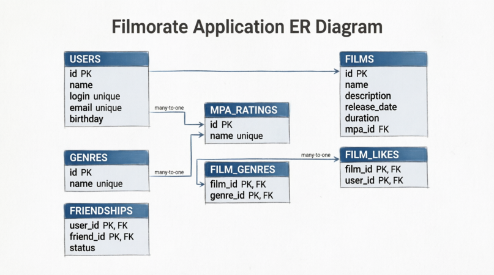

# Filmorate

Приложение для обмена лайками на фильмы и управления друзьями.

## Схема базы данных



[Открыть в dbdiagram.io](https://dbdiagram.io/d/...)

## Описание таблиц

| Таблица | Описание |
|---------|----------|
| `users` | Пользователи приложения |
| `films` | Фильмы |
| `genres` | Жанры фильмов (справочник) |
| `mpa_ratings` | Возрастные рейтинги (справочник) |
| `film_genres` | Связь фильмов и жанров (many-to-many) |
| `film_likes` | Лайки пользователей к фильмам |
| `friendships` | Дружеские связи между пользователями |

## Примеры запросов

### Получить всех пользователей
```sql
SELECT * FROM users;
