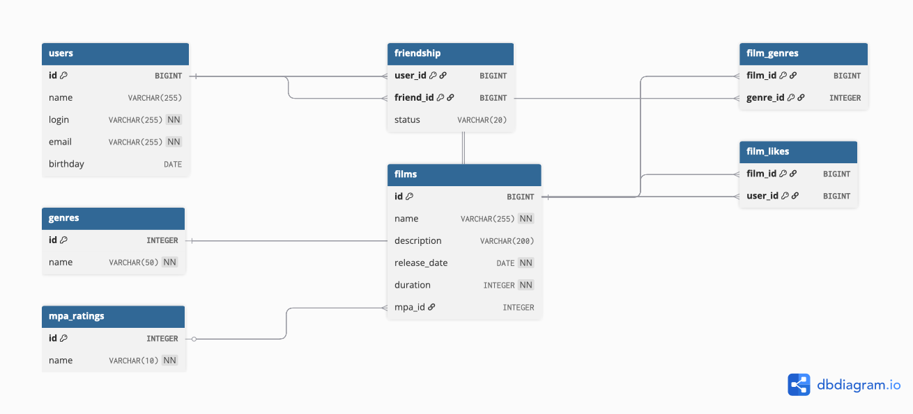

# Filmorate API

Сервис для управления фильмами, пользователями и их взаимодействием (лайки, друзья).  
Проект разработан в рамках обучения на Java-разработчика (Яндекс.Практикум).

## 📚 Описание

Приложение позволяет:
- Управлять списком пользователей (создание, обновление, получение).
- Управлять каталогом фильмов (добавление, редактирование, удаление).
- Реализовывать социальную функциональность: добавление в друзья, удаление из друзей, поиск общих друзей.
- Оценивать фильмы (лайки/дизлайки) и формировать рейтинг популярности.
- Фильтровать фильмы по жанрам и возрастному рейтингу (MPA).

---

## 🗄 Схема базы данных

База данных спроектирована в соответствии с третьей нормальной формой (3NF):
- Все таблицы содержат атомарные значения (нет массивов или вложенных структур).
- Исключены избыточные дублирования данных.
- Связи «многие-ко-многим» (жанры, лайки, друзья) реализованы через промежуточные таблицы.



### Описание таблиц:

| Таблица | Описание |
| :--- | :--- |
| `users` | Основные данные пользователей (логин, email, дата рождения). |
| `films` | Информация о фильмах (название, описание, дата выхода, длительность). |
| `genres` | Справочник жанров. |
| `mpa_ratings` | Справочник возрастных рейтингов (G, PG, PG-13, R, NC-17). |
| `film_genres` | Связь фильмов и жанров (many-to-many). |
| `film_likes` | Лайки пользователей к фильмам (используется для расчета популярности). |
| `friendship` | Связи между пользователями (друзья) со статусом подтверждения. |

---

## 🛠 Технологии

- **Java 21**
- **Spring Boot 3** (Web, Validation, JDBC)
- **Base de datos**: H2 (для тестов) / PostgreSQL (для продакшена)
- **Lombok** (для сокращения шаблонного кода)
- **Maven** (сборка проекта)
- **JUnit 5** (тестирование)

---

## 📝 Примеры SQL-запросов

Ниже приведены примеры запросов, реализующих ключевую бизнес-логику приложения.

### 1. Получить список всех фильмов
```sql
SELECT * FROM films;
